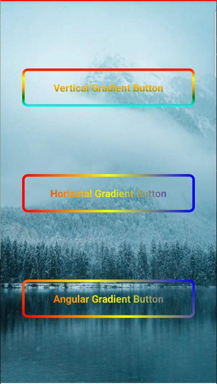

# React Native Gradient Button

[](https://www.npmjs.com/package/@gradient-border/react-native-gradient-button)
[](https://www.npmjs.com/package/@gradient-border/react-native-gradient-button)
[](https://github.com/05prateek/react-native-gradient-button/blob/main/LICENSE)

A powerful and customizable gradient button component for React Native that supports both gradient borders and text. Perfect for creating beautiful, modern UI elements with minimal effort.

## ✨ Features

- 🎨 Beautiful gradient borders and text effects
- 📱 Fully customizable styles and animations
- 🎯 Written in TypeScript with full type support
- 📏 Flexible sizing and positioning
- ♿ Built-in accessibility support
- 📦 Lightweight with minimal dependencies
- 📱 Works on both iOS and Android

## Installation

npm

```bash
npm install @gradient-border/react-native-gradient-button
```

yarn

```bash
yarn add @gradient-border/react-native-gradient-button
```

### Dependencies

npm
```bash
npm install @react-native-masked-view/masked-view react-native-linear-gradient
```

yarn
```bash
yarn add @react-native-masked-view/masked-view react-native-linear-gradient
```

This component requires the following dependencies to be installed:

## Usage
```tsx
import GradientButton from 'react-native-gradient-button';
const MyComponent = () => {
return (
<GradientButton
text="Click me"
colors={['#FF6B6B', '#FFA62B']}
onPress={() => console.log('Button pressed')}
style={{ borderRadius: 8, height: 50 }}
/>
);
};
```

## Props

| Prop | Type | Required | Default | Description |
|------|------|----------|---------|-------------|
| text | string | Yes | - | The text to display on the button |
| colors | string[] | Yes | - | Array of at least 2 colors for the gradient |
| onPress | () => void | Yes | - | Function to call when button is pressed |
| style | ViewStyle | No | - | Custom styles for the button |
| textStyle | TextStyle | No | - | Custom styles for the button text |
| start | { x: number; y: number } | No | { x: 0, y: 0 } | Start point of gradient |
| end | { x: number; y: number } | No | { x: 1, y: 0 } | End point of gradient |
| locations | number[] | No | - | Locations of each gradient color stop |
| useAngle | boolean | No | false | Use angle for gradient instead of start/end points |
| angle | number | No | 0 | Angle of gradient when useAngle is true |
| disabled | boolean | No | false | Whether the button is disabled |
| activeOpacity | number | No | 0.7 | Opacity when button is pressed |
| loading | boolean | No | false | Shows loading indicator when true |
| loadingColor | string | No | '#FFFFFF' | Color of the loading indicator |
| loadingSize | 'small' \| 'large' | No | 'small' | Size of the loading indicator |
| angleCenter | { x: number; y: number } | No | undefined | Center point for angle-based gradients |

## Style Guide

### Gradient Direction

You can control the gradient direction using either the `start`/`end` props or `useAngle`/`angle` props:

```tsx
// Horizontal gradient (default)
<GradientButton
text="Horizontal"
colors={['#FF6B6B', '#FFA62B']}
start={{ x: 0, y: 0 }}
end={{ x: 1, y: 0 }}
/>
// Vertical gradient
<GradientButton
text="Vertical"
colors={['#FF6B6B', '#FFA62B']}
start={{ x: 0, y: 0 }}
end={{ x: 0, y: 1 }}
/>
// Diagonal gradient using angle
<GradientButton
text="Diagonal"
colors={['#FF6B6B', '#FFA62B']}
useAngle={true}
angle={45}
/>
```

## Example
```tsx
import React from 'react';
import {
  SafeAreaView,

  StyleSheet,

  ImageBackground,
} from 'react-native';
import GradientButton from '@gradient-border/react-native-gradient-button';


function App(): JSX.Element {


  return (
    <ImageBackground 
      source={{ uri: 'https://images.pexels.com/photos/3265460/pexels-photo-3265460.jpeg?auto=compress&cs=tinysrgb&w=1260&h=750&dpr=1' }}
      style={styles.backgroundImage}
    >
      <SafeAreaView style={[styles.container]}>

            <GradientButton
              text="Vertical Gradient Button"
              textStyle={styles.ButtonText}
              colors={['red', 'yellow', 'orange', 'green', 'cyan']}
              start={{ x: 0, y: 0 }}
              end={{ x: 0, y: 1 }}
              onPress={() => console.log('Primary pressed')}
              style={styles.button}
            />

            <GradientButton
              text="Horizotal Gradient Button"
              textStyle={styles.ButtonText}
              start={{ x: 0, y: 0 }}
              end={{ x: 1, y: 0 }}
              colors={['red', 'yellow', 'blue']}
              onPress={() => console.log('Secondary pressed')}
              style={styles.button}
            />

            <GradientButton
              text="Angular Gradient Button"
              textStyle={styles.ButtonText}
              useAngle={true}
              angle={45}
              angleCenter={{x:0.5,y:0.5}}
              colors={['red', 'yellow', 'blue']}
              onPress={() => console.log('Secondary pressed')}
              style={styles.button}
            />


      </SafeAreaView>
    </ImageBackground>
  );
}


const styles = StyleSheet.create({
  backgroundImage: {
    flex: 1,
    width: '100%',
    height: '100%',

  },
  container: {
    flex: 1,
    justifyContent: 'space-evenly',
    alignItems: 'center',
  },

 

  button: {
    marginTop: 4,
    borderRadius: 10,
    borderWidth:4.5,
    height: '10%',
    width: '80%',
    justifyContent: 'center',
    alignItems: 'center',

  },
  ButtonText: {
    fontSize: 18,
    fontWeight: 'bold',
  },
});

export default App;
```
## Screenshots


## Accessibility

The component includes built-in accessibility support:

```tsx
<GradientButton
  text="Submit"
  colors={['#FF6B6B', '#FFA62B']}
  accessibilityLabel="Submit form button"
  accessibilityHint="Double tap to submit the form"
/>
```

### Accessibility Props

| Prop | Type | Default | Description |
|------|------|---------|-------------|
| accessibilityLabel | string | button's text | Text to be read by screen readers |
| accessibilityHint | string | undefined | Additional description of the button's action |
| accessibilityRole | 'button' | 'button' | Tells screen readers this is a button element |

Best practices for accessibility:
1. Always provide clear `accessibilityLabel` when the button's text alone isn't descriptive enough
2. Use `accessibilityHint` to explain what will happen when the button is pressed
3. Keep labels and hints concise but descriptive

### Style Restrictions

The following style properties are not allowed and will be ignored with a warning:
- backgroundColor
- borderColor
- shadowColor
- color (in textStyle)
- textDecorationColor (in textStyle)
- textShadowColor (in textStyle)

## 🚀 Why Choose This Package?

- Modern API with TypeScript support
- Highly customizable gradient effects
- Excellent performance with minimal re-renders
- Comprehensive documentation
- Small bundle size

